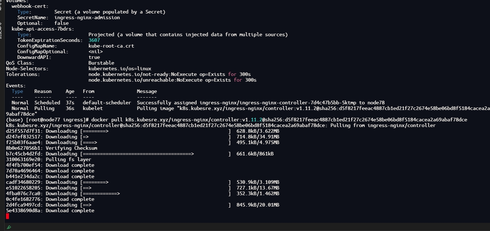
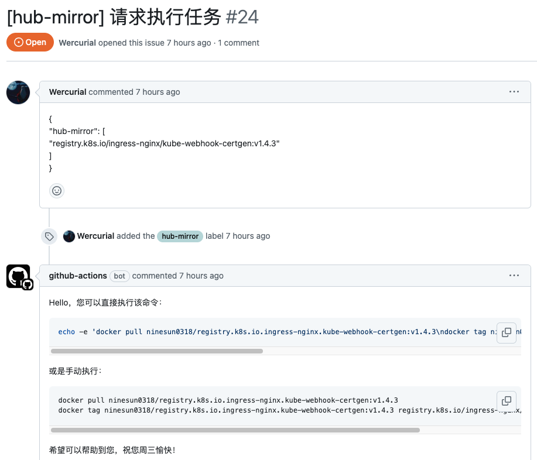

## 事出有因：

自2024年5月底6月初，由于某些原因，突然间在国内就无法正常访问和拉取Docker镜像源，鉴于本人目前从事云原生ModelOps工作，几乎每天都要和K8S、Docker打交道，镜像无法拉取一直让人很苦恼和无奈，所以在日常工作和探索中，总结汇总了如下可以拉去的官方镜像源的解决方案，这些方案可能会随着时间的推移无法使用，若是如此请见谅!


## 迎刃而解

### 方案一：在线下载

- [渡渡鸟的容器镜像小站](https://docker.aityp.com/)：本站作者宣传100%同步官方镜像，目前支持同步镜像源：gcr.io ghcr.io quay.io k8s.gcr.io docker.io registry.k8s.io docker.elastic.co skywalking.docker.scarf.sh 单个镜像大小限制2G，全站目前镜像索引数量4262，同步1502GB;

  

### 方案二：在拉取镜像加上下列前缀

- 推荐项目1：https://github.com/DaoCloud/public-image-mirror
- 推荐项目2：https://github.com/kubesre/docker-registry-mirrors

| **源站** | **替换为** |
| --- | --- |
| cr.l5d.io | l5d.kubesre.xyz |
| docker.elastic.co | elastic.kubesre.xyz |
| docker.io | dhub.kubesre.xyz |
| gcr.io | gcr.kubesre.xyz |
| ghcr.io | ghcr.kubesre.xyz |
| k8s.gcr.io | k8s-gcr.kubesre.xyz |
| registry.k8s.io | k8s.kubesre.xyz |
| mcr.microsoft.com | mcr.kubesre.xyz |
| nvcr.io | nvcr.kubesre.xyz |
| quay.io | quay.kubesre.xyz |
| registry.jujucharms.com | jujucharms.kubesre.xy |

```bash
# 示例
docker pull k8s.kubesre.xyz/ingress-nginx/opentelemetry-1.25.3-v20240813-b93310d
```


### 方案三： 通过开源项目的 issue

> 此方案适用于可以访问Docker镜像仓库，但无法访问其他镜像仓库（registry.k8s.io、gcr.io 等）。

- [https://github.com/myysophia/hub-mirror](https://github.com/myysophia/hub-mirror)

使用说明：

1. 在该项目中创建一个新issue，会出现一个模板，将模板内容修改为需要拉去的镜像，提交issue，就会触发github的CI，就会进行拉去拉取镜像，并推送到公开Docker仓库。

```json
{
    "hub-mirror": [
        "你需要转换的镜像",
        "你需要转换的镜像",
        "每次最多 11 个",
        "改这个 json 就可以了",
        "别乱改内容",
        "标题随意，保持阵型是最好的",
        "hub-mirror 标签是必选的",
        "......"
    ]
}

####################PS改成下面这个################
{
"hub-mirror": [
  "registry.k8s.io/ingress-nginx/kube-webhook-certgen:v1.4.3"
  ]
}
####################PS改成下面这个################
```

2. 然后从docker镜像仓库拉去所需要的镜像
