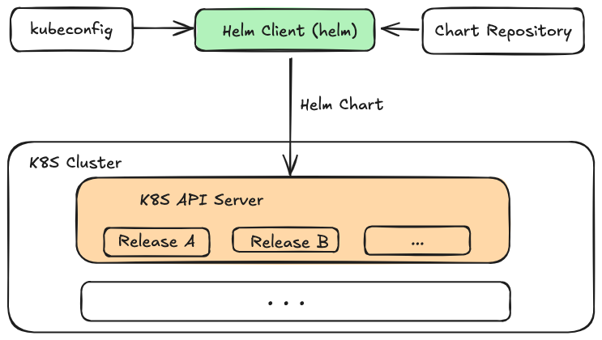

## Helm概述

### 基本信息

- Github地址：[Helm](https://github.com/helm/helm)
- [文档地址](https://helm.sh/)
- 当前最新版本v3.15.4，当前Star数26.6k.
- Chart包托管平台：[ArtifactHub](https://artifacthub.io/)

### Helm是什么？

Helm是Kubernetes（K8S）的包管理工具，Helm主要是用来管理Chart包，类似于Python的pip、CentOS的yum、MacOS的brew等。Helm主要有三大基本概念，分别为：

- **Chart**: 代表一个Helm包，它包含了在K8S集群中运行的应用程序、工具或服务所需要的所有YAML格式的资源定义文件以及这些资源的配置，可以通过Helm Chart包来整体维护这些资源。
- **Repository**：它是用来存放和共享Helm Chart的地方，类似于存放源码的Github的Repository，以及存放镜像的Docker的Repository。
- **Release**: 它是运行在K8S集群中的Chart的实例。一个Chart通常可以在同一个集群中安装多次。每一次安装都会创建一个新的Release。

Helm也提供了一个helm命令行工具，该工具可以基于Chartb包一键创建应用，在创建应用时，可以自定义Chart配置。应用发布者可以通过Helm打包应用、管理应用依赖管理，管理应用版本、并发布应用到软件仓库。

- 对于使用者来说，使用Helm后不需要写复杂的应用部署文件，可以非常方便的在K8S上查找、安装、升级、回滚以及卸载应用程序。

### Helm架构



Helm Client（helm命令）和Helm Chart包时核心，helm命令可以从Chart Repository中下载Helm Chart包，读取kubeconfig文件，并构建kube-apiserver REST API 接口的HTTP请求，通过调用K8S提供的REST API 接口，将Chart包中包含的YAML格式定义的K8S资源，在K8S集群中创建， 这些资源以Release的形式存在与K8S集群中，每个Release 又包含多个K8S资源，如Deployment、Pod、Service等。

### Helm组成


- 模板文件

    - 【通常有多个】，基于`text/template` 模板文件，提供了强大的模板渲染能力。Helm可以将配置文件中的值渲染进模板文件中，最终生成一个可以部署的K8S YAML格式的资源定义文件。

- 配置文件
  
    - 【通常有一个】

总结：

- 在Helm中，**部署一个应用可以简化为Chart模板（多个服务）+ Chart配置 —> 应用**。
- Chart模板一个应用只用编写一次，可以重复使用，再部署时，可以指定不同的配置，从而将应用部署到不同环境或同一环境部署不同配置的应用。


## Helm安装

### 先决条件

- 一个可用的K8S集群
- 确定安装版本和安全配置
- 安装和配置Helm

安装

- [官方安装指南](https://helm.sh/zh/docs/intro/install/)
- Helm 各个版本安装包：[Helm Releases](https://github.com/helm/helm/releases)

### 安装步骤

```bash
$ wget https://get.helm.sh/helm-v3.15.4-linux-amd64.tar.gz
$ tar -xvzf helm-v3.15.4-linux-amd64.tar.gz
$ mv linux-amd64/helm /usr/local/bin/helm
$ chmod +x /usr/local/bin/helm
$ helm version  # 输出版本号即表示安装成功
######log info ########
version.BuildInfo{Version:"v3.15.4", GitCommit:"fa9efb07d9d8debbb4306d72af76a383895aa8c4", GitTreeState:"clean", GoVersion:"go1.22.6"}
```

安装helm命令自动补全脚本（非必须）

- [文档参考](https://helm.sh/docs/helm/helm_completion/)

```bash
helm completion bash > /etc/bash_completion.d/helm
```

- 执行 helm comp，就会自动补全为helm completion。


## Helm使用


## Helm常用命令汇总

| 命令       | 描述                                                         |
| ---------- | ------------------------------------------------------------ |
| completion | 生成指定Shell的自动补全脚本，比如bash、zsh等                 |
| create     | 创建一个 Chart 并指定名字                                    |
| dependency | 管理 Chart 依赖                                              |
| env        | 打印Helm客户端的环境变量信息，例如HELM_CACHE_HOME、HELM_NAMESPACE、HELM_REPOSITORY_CONFIG等 |
| get        | 下载一个 Release。可用子命令：all、hooks、manifest、notes、values |
| help       | 打印helm命令的帮助信息                                       |
| history    | 获取 Release历史                                             |
| install    | 安装一个 Chart                                               |
| lint       | 检查一个Chart包，并打印潜在的问题                            |
| list       | 列出 Release                                                 |
| package    | 将 Chart 目录打包到 Chart 存储文件中                         |
| plugin     | Helm插件                                                     |
| pull       | 从远程仓库中下载 Chart 并解压到本地，例如helm pull stable/redis --untar |
| repo       | 添加（add）、列出（list）、移除（remove）、更新（update）和索引（index）Chart 仓库 |
| rollback   | 从之前版本回滚                                               |
| search     | 根据关键字搜索 Charts，可用子命令：hub、repo                 |
| show       | 查看 Chart 详细信息。可用子命令：all、chart、readme、values  |
| status     | 显示已命名版本的状态                                         |
| template   | 本地呈现模板                                                 |
| test       | 在 Release 中运行 Helm 中的预定义测试                        |
| uninstall  | 卸载一个 Release                                             |
| upgrade    | 更新一个 Release                                             |
| verify     | 验证给定路径的Chart是否已被签名且有效                        |
| version    | 查看 Helm 客户端版本                                         |