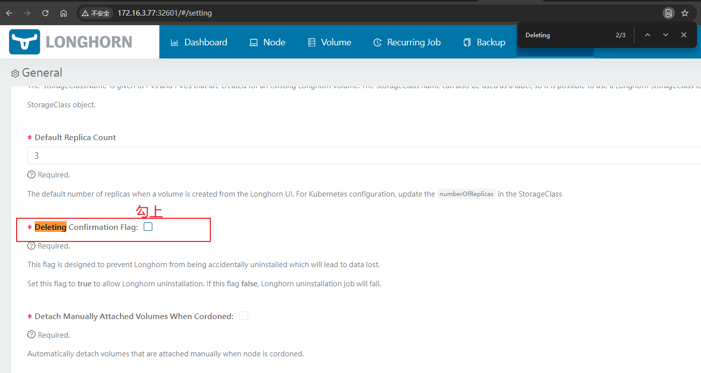

## 概述
Longhorn是基于Kubernetes和Container的构建的分布式块存储系统，轻量、可靠且功能强大， Longhorn为每个块设备卷创建一个专门的存储控制器，并且对多个节点上存储副本中的卷进行实时复制。以下是它的主要特点：

- Longhorn的卷可以作为Kubernetes集群中分布式有状态应用的存储。
- 可以将块存储划分为Longhorn卷，以便在有或没有云提供商的情况下使用Kubernetes卷。
- 可以跨节点和数据中心复制块存储，从而提高可用性。
- 可以在外部存储上存储备份数据，例如：NFSv4或AWS S3。
- 可以创建跨群集灾难恢复卷，以便从备用的Kubernetes集群的备份中快速恢复来自主Kubernetes群集的数据。
- 可以为卷设置计划，对卷定期生成快照，并把快照备份到NFS或者兼容S3的备用存储中。
- 支持从备份中恢复卷。
- 支持不中断卷服务的情况下进行升级。

项目信息：

- [官方地址](https://longhorn.io/)
- [Github](https://github.com/longhorn/longhorn): 当前项目版本V1.7, 比较活跃，Star数：5.9k、Fork数：585


## 安装部署

### 前提条件

- 一个正常运行的Kubernetes集群
- 集群每个节点已经安装下列软件包，并正常启动
   - open-iscsi（iscsid服务）
      - 安装： yum install iscsi-initiator-utils

### 环境检测

- 各存储节点创建目录及挂载

```bash
# 将存储盘挂载到/data1所在目录，并创建longhorn目录
mkdir -p /home/data1/longhorn
```

   - 存储节点使用命令打标签：kubectl label nodes node77  node78  node79 node.longhorn.io/create-default-disk=true
- 安装longhorn所需系统依赖

```bash
yum install -y nfs-utils
yum --setopt=tsflags=noscripts install iscsi-initiator-utils
echo "InitiatorName=$(/sbin/iscsi-iname)" > /etc/iscsi/initiatorname.iscsi
systemctl enable iscsid
systemctl start iscsid

wget https://github.com/stedolan/jq/releases/download/jq-1.6/jq-linux64 -O /usr/local/bin/jq
chmod +x /usr/local/bin/jq
```

- 新建longhorn_check_env.sh文件，将下列内容拷贝进入，保存并执行。

```bash
#!/bin/bash

NVME_CLI_VERSION="1.12"

######################################################
# Log
######################################################
export RED='\x1b[0;31m'
export GREEN='\x1b[38;5;22m'
export CYAN='\x1b[36m'
export YELLOW='\x1b[33m'
export NO_COLOR='\x1b[0m'

if [ -z "${LOG_TITLE}" ]; then
  LOG_TITLE=''
fi
if [ -z "${LOG_LEVEL}" ]; then
  LOG_LEVEL="INFO"
fi

debug() {
  if [[ "${LOG_LEVEL}" == "DEBUG" ]]; then
    local log_title
    if [ -n "${LOG_TITLE}" ]; then
     log_title="(${LOG_TITLE})"
    else
     log_title=''
    fi
    echo -e "${GREEN}[DEBUG]${log_title} ${NO_COLOR}$1"
  fi
}

info() {
  if [[ "${LOG_LEVEL}" == "DEBUG" ]] ||\
     [[ "${LOG_LEVEL}" == "INFO" ]]; then
    local log_title
    if [ -n "${LOG_TITLE}" ]; then
     log_title="(${LOG_TITLE})"
    else
     log_title=''
    fi
    echo -e "${CYAN}[INFO] ${log_title} ${NO_COLOR}$1"
  fi
}

warn() {
  if [[ "${LOG_LEVEL}" == "DEBUG" ]] ||\
     [[ "${LOG_LEVEL}" == "INFO" ]] ||\
     [[ "${LOG_LEVEL}" == "WARN" ]]; then
    local log_title
    if [ -n "${LOG_TITLE}" ]; then
     log_title="(${LOG_TITLE})"
    else
     log_title=''
    fi
    echo -e "${YELLOW}[WARN] ${log_title} ${NO_COLOR}$1"
  fi
}

error() {
  if [[ "${LOG_LEVEL}" == "DEBUG" ]] ||\
     [[ "${LOG_LEVEL}" == "INFO" ]] ||\
     [[ "${LOG_LEVEL}" == "WARN" ]] ||\
     [[ "${LOG_LEVEL}" == "ERROR" ]]; then
    local log_title
    if [ -n "${LOG_TITLE}" ]; then
     log_title="(${LOG_TITLE})"
    else
     log_title=''
    fi
    echo -e "${RED}[ERROR]${log_title} ${NO_COLOR}$1"
  fi
}

######################################################
# Check logics
######################################################
set_packages_and_check_cmd() {
  case $OS in
  *"debian"* | *"ubuntu"* )
    CHECK_CMD='dpkg -l | grep -w'
    PACKAGES=(nfs-common open-iscsi cryptsetup dmsetup)
    ;;
  *"centos"* | *"fedora"* | *"rocky"* | *"ol"* )
    CHECK_CMD='rpm -q'
    PACKAGES=(nfs-utils iscsi-initiator-utils cryptsetup device-mapper)
    ;;
  *"suse"* )
    CHECK_CMD='rpm -q'
    PACKAGES=(nfs-client open-iscsi cryptsetup device-mapper)
    ;;
  *"arch"* )
    CHECK_CMD='pacman -Q'
    PACKAGES=(nfs-utils open-iscsi cryptsetup device-mapper)
    ;;
  *"gentoo"* )
    CHECK_CMD='qlist -I'
    PACKAGES=(net-fs/nfs-utils sys-block/open-iscsi sys-fs/cryptsetup sys-fs/lvm2)
    ;;
  *)
    CHECK_CMD=''
    PACKAGES=()
    warn "Stop the environment check because '$OS' is not supported in the environment check script."
    exit 1
    ;;
   esac
}

detect_node_kernel_release() {
  local pod="$1"

  KERNEL_RELEASE=$(kubectl exec $pod -- nsenter --mount=/proc/1/ns/mnt -- bash -c 'uname -r')
  echo "$KERNEL_RELEASE"
}

detect_node_os() {
  local pod="$1"

  OS=$(kubectl exec $pod -- nsenter --mount=/proc/1/ns/mnt -- bash -c 'grep -E "^ID_LIKE=" /etc/os-release | cut -d= -f2')
  if [[ -z "${OS}" ]]; then
    OS=$(kubectl exec $pod -- nsenter --mount=/proc/1/ns/mnt -- bash -c 'grep -E "^ID=" /etc/os-release | cut -d= -f2')
  fi
  echo "$OS"
}

check_local_dependencies() {
  local targets=($@)

  local all_found=true
  for ((i=0; i<${#targets[@]}; i++)); do
    local target=${targets[$i]}
    if [ "$(which $target)" = "" ]; then
      all_found=false
      error "Not found: $target"
    fi
  done

  if [ "$all_found" = "false" ]; then
    msg="Please install missing dependencies: ${targets[@]}."
    info "$msg"
    exit 2
  fi

  msg="Required dependencies '${targets[@]}' are installed."
  info "$msg"
}

create_ds() {
cat <<EOF > $TEMP_DIR/environment_check.yaml
apiVersion: apps/v1
kind: DaemonSet
metadata:
  labels:
    app: longhorn-environment-check
  name: longhorn-environment-check
spec:
  selector:
    matchLabels:
      app: longhorn-environment-check
  template:
    metadata:
      labels:
        app: longhorn-environment-check
    spec:
      hostPID: true
      containers:
      - name: longhorn-environment-check
        image: alpine:3.12
        args: ["/bin/sh", "-c", "sleep 1000000000"]
        volumeMounts:
        - name: mountpoint
          mountPath: /tmp/longhorn-environment-check
          mountPropagation: Bidirectional
        securityContext:
          privileged: true
      volumes:
      - name: mountpoint
        hostPath:
            path: /tmp/longhorn-environment-check
EOF
  kubectl create -f $TEMP_DIR/environment_check.yaml > /dev/null
}

cleanup() {
  info "Cleaning up longhorn-environment-check pods..."
  kubectl delete -f $TEMP_DIR/environment_check.yaml > /dev/null
  rm -rf $TEMP_DIR
  info "Cleanup completed."
}

wait_ds_ready() {
  while true; do
    local ds=$(kubectl get ds/longhorn-environment-check -o json)
    local numberReady=$(echo $ds | jq .status.numberReady)
    local desiredNumberScheduled=$(echo $ds | jq .status.desiredNumberScheduled)

    if [ "$desiredNumberScheduled" = "$numberReady" ] && [ "$desiredNumberScheduled" != "0" ]; then
      info "All longhorn-environment-check pods are ready ($numberReady/$desiredNumberScheduled)."
      return
    fi

    info "Waiting for longhorn-environment-check pods to become ready ($numberReady/$desiredNumberScheduled)..."
    sleep 3
  done
}

check_mount_propagation() {
  local allSupported=true
  local pods=$(kubectl -l app=longhorn-environment-check get po -o json)

  local ds=$(kubectl get ds/longhorn-environment-check -o json)
  local desiredNumberScheduled=$(echo $ds | jq .status.desiredNumberScheduled)

  for ((i=0; i<desiredNumberScheduled; i++)); do
    local pod=$(echo $pods | jq .items[$i])
    local nodeName=$(echo $pod | jq -r .spec.nodeName)
    local mountPropagation=$(echo $pod | jq -r '.spec.containers[0].volumeMounts[] | select(.name=="mountpoint") | .mountPropagation')

    if [ "$mountPropagation" != "Bidirectional" ]; then
      allSupported=false
      error "node $nodeName: MountPropagation is disabled"
    fi
  done

  if [ "$allSupported" != "true" ]; then
    error "MountPropagation is disabled on at least one node. As a result, CSI driver and Base image cannot be supported"
    exit 1
  else
    info "MountPropagation is enabled"
  fi
}

check_hostname_uniqueness() {
  hostnames=$(kubectl get nodes -o jsonpath='{.items[*].status.addresses[?(@.type=="Hostname")].address}')

  if [ $? -ne 0 ]; then
    error "kubectl get nodes failed - check KUBECONFIG setup"
    exit 1
  fi

  if [[ ! ${hostnames[@]} ]]; then
    error "kubectl get nodes returned empty list - check KUBECONFIG setup"
    exit 1
  fi

  deduplicate_hostnames=()
  num_nodes=0
  for hostname in ${hostnames}; do
    num_nodes=$((num_nodes+1))
    if ! echo "${deduplicate_hostnames[@]}" | grep -q "\<${hostname}\>"; then
      deduplicate_hostnames+=("${hostname}")
    fi
  done

  if [ "${#deduplicate_hostnames[@]}" != "${num_nodes}" ]; then
    error "Nodes do not have unique hostnames."
    exit 2
  fi

  info "All nodes have unique hostnames."
}

check_nodes() {
  local name=$1
  local callback=$2
  shift
  shift

  info "Checking $name..."

  local all_passed=true

  local pods=$(kubectl get pods -o name -l app=longhorn-environment-check)
  for pod in ${pods}; do
    eval "${callback} ${pod} $@"
    if [ $? -ne 0 ]; then
      all_passed=false
    fi
  done

  if [ "$all_passed" = "false" ]; then
    return 1
  fi
}

verlte() {
    printf '%s\n' "$1" "$2" | sort -C -V
}

verlt() {
    ! verlte "$2" "$1"
}

kernel_in_range() {
    verlte "$2" "$1" && verlt "$1" "$3"
}

check_kernel_release() {
  local pod=$1
  local node=$(kubectl get ${pod} --no-headers -o=custom-columns=:.spec.nodeName)

  recommended_kernel_release="5.8"

  local kernel=$(detect_node_kernel_release ${pod})

  if verlt "$kernel" "$recommended_kernel_release"  ; then
    warn "Node $node has outdated kernel release: $kernel. Recommending kernel release >= $recommended_kernel_release"
    return 1
  fi

  local broken_kernel=("5.15.0-94" "6.5.6")
  local fixed_kernel=("5.15.0-100" "6.5.7")

  for i in ${!broken_kernel[@]}; do
      if kernel_in_range "$kernel" "${broken_kernel[$i]}" "${fixed_kernel[$i]}" ; then
        warn "Node $node has a kernel version $kernel known to have a breakage that affects Longhorn. See description and solution at https://longhorn.io/kb/troubleshooting-rwx-volume-fails-to-attached-caused-by-protocol-not-supported"
        return 1
      fi
  done

}

check_iscsid() {
  local pod=$1

  kubectl exec ${pod} -- nsenter --mount=/proc/1/ns/mnt -- bash -c "systemctl status --no-pager iscsid.service" > /dev/null 2>&1
  if [ $? -ne 0 ]; then
    kubectl exec ${pod} -- nsenter --mount=/proc/1/ns/mnt -- bash -c "systemctl status --no-pager iscsid.socket" > /dev/null 2>&1
      if [ $? -ne 0 ]; then
      node=$(kubectl get ${pod} --no-headers -o=custom-columns=:.spec.nodeName)
      error "Neither iscsid.service nor iscsid.socket is running on ${node}"
      return 1
    fi
  fi
}

check_multipathd() {
  local pod=$1

  kubectl exec $pod -- nsenter --mount=/proc/1/ns/mnt -- bash -c "systemctl status --no-pager multipathd.service" > /dev/null 2>&1
  if [ $? = 0 ]; then
    node=$(kubectl get ${pod} --no-headers -o=custom-columns=:.spec.nodeName)
    warn "multipathd is running on ${node} known to have a breakage that affects Longhorn.  See description and solution at https://longhorn.io/kb/troubleshooting-volume-with-multipath"
    return 1
  fi
}

check_packages() {
  local pod=$1

  OS=$(detect_node_os ${pod})
  if [ x"$OS" = x"" ]; then
    error "Failed to detect OS on node ${node}"
    return 1
  fi

  set_packages_and_check_cmd

  for ((i=0; i<${#PACKAGES[@]}; i++)); do
    check_package ${PACKAGES[$i]}
    if [ $? -ne 0 ]; then
      return 1
    fi
  done
}

check_package() {
  local package=$1

  kubectl exec $pod -- nsenter --mount=/proc/1/ns/mnt -- timeout 30 bash -c "$CHECK_CMD $package" > /dev/null 2>&1
  if [ $? -ne 0 ]; then
    node=$(kubectl get ${pod} --no-headers -o=custom-columns=:.spec.nodeName)
    error "$package is not found in $node."
    return 1
  fi
}

check_nfs_client() {
  local pod=$1
  local node=$(kubectl get ${pod} --no-headers -o=custom-columns=:.spec.nodeName)

  local options=("CONFIG_NFS_V4_2"  "CONFIG_NFS_V4_1" "CONFIG_NFS_V4")

  local kernel=$(detect_node_kernel_release ${pod})
  if [ "x${kernel}" = "x" ]; then
    warn "Failed to check NFS client installation, because unable to detect kernel release on node ${node}"
    return 1
  fi

  for option in "${options[@]}"; do
    kubectl exec ${pod} -- nsenter --mount=/proc/1/ns/mnt -- bash -c "[ -f /boot/config-${kernel} ]" > /dev/null 2>&1
    if [ $? -ne 0 ]; then
      warn "Failed to check $option on node ${node}, because /boot/config-${kernel} does not exist on node ${node}"
      continue
    fi

    check_kernel_module ${pod} ${option} nfs
    if [ $? = 0 ]; then
      return 0
    fi
  done

  error "NFS clients ${options[*]} not found. At least one should be enabled"
  return 1
}

check_kernel_module() {
  local pod=$1
  local option=$2
  local module=$3

  local kernel=$(detect_node_kernel_release ${pod})
  if [ "x${kernel}" = "x" ]; then
    warn "Failed to check kernel config option ${option}, because unable to detect kernel release on node ${node}"
    return 1
  fi

  kubectl exec ${pod} -- nsenter --mount=/proc/1/ns/mnt -- bash -c "[ -e /boot/config-${kernel} ]" > /dev/null 2>&1
  if [ $? -ne 0 ]; then
    warn "Failed to check kernel config option ${option}, because /boot/config-${kernel} does not exist on node ${node}"
    return 1
  fi

  value=$(kubectl exec ${pod} -- nsenter --mount=/proc/1/ns/mnt -- bash -c "grep "^$option=" /boot/config-${kernel} | cut -d= -f2")
  if [ -z "${value}" ]; then
    error "Failed to find kernel config $option on node ${node}"
    return 1
  elif [ "${value}" = "m" ]; then
    kubectl exec ${pod} -- nsenter --mount=/proc/1/ns/mnt -- bash -c "lsmod | grep ${module}" > /dev/null 2>&1
    if [ $? -ne 0 ]; then
      node=$(kubectl get ${pod} --no-headers -o=custom-columns=:.spec.nodeName)
      error "kernel module ${module} is not enabled on ${node}"
      return 1
    fi
  elif [ "${value}" = "y" ]; then
    return 0
  else
    warn "Unknown value for $option: $value"
    return 1
  fi
}

check_hugepage() {
  local pod=$1
  local expected_nr_hugepages=$2

  nr_hugepages=$(kubectl exec ${pod} -- nsenter --mount=/proc/1/ns/mnt -- bash -c 'cat /proc/sys/vm/nr_hugepages')
  if [ $? -ne 0 ]; then
    error "Failed to check hugepage size on node ${node}"
    return 1
  fi

  if [ $nr_hugepages -lt $expected_nr_hugepages ]; then
    error "Hugepage size is not enough on node ${node}. Expected: ${expected_nr_hugepages}, Actual: ${nr_hugepages}"
    return 1
  fi
}

function check_sse42_support() {
  local pod=$1

  node=$(kubectl get ${pod} --no-headers -o=custom-columns=:.spec.nodeName)

  machine=$(kubectl exec $pod -- nsenter --mount=/proc/1/ns/mnt -- bash -c 'uname -m' 2>/dev/null)
  if [ $? -ne 0 ]; then
    error "Failed to check machine on node ${node}"
    return 1
  fi

  if [ "$machine" = "x86_64" ]; then
    sse42_support=$(kubectl exec $pod -- nsenter --mount=/proc/1/ns/mnt -- bash -c 'grep -o sse4_2 /proc/cpuinfo | wc -l' 2>/dev/null)
    if [ $? -ne 0 ]; then
      error "Failed to check SSE4.2 instruction set on node ${node}"
      return 1
    fi

    if [ "$sse42_support" -ge 1 ]; then
      return 0
    fi

    error "CPU does not support SSE4.2"
    return 1
  else
    warn "Skip SSE4.2 instruction set check on node ${node} because it is not x86_64"
  fi
}

function show_help() {
    cat <<EOF
Usage: $0 [OPTIONS]

Options:
    -s, --enable-spdk           Enable checking SPDK prerequisites
    -p, --expected-nr-hugepages Expected number of 2 MiB hugepages for SPDK. Default: 1024
    -h, --help                  Show this help message and exit
EOF
    exit 0
}

enable_spdk=false
expected_nr_hugepages=1024
while [[ $# -gt 0 ]]; do
    opt="$1"
    case $opt in
        -s|--enable-spdk)
            enable_spdk=true
            ;;
        -p|--expected-nr-hugepages)
            expected_nr_hugepages="$2"
            shift
            ;;
        -h|--help)
            show_help
            ;;
        *)
            instance_manager_options+=("$1")
            ;;
    esac
    shift
done

######################################################
# Main logics
######################################################
DEPENDENCIES=("kubectl" "jq" "mktemp" "sort" "printf")
check_local_dependencies "${DEPENDENCIES[@]}"

# Check the each host has a unique hostname (for RWX volume)
check_hostname_uniqueness

# Create a daemonset for checking the requirements in each node
TEMP_DIR=$(mktemp -d)

trap cleanup EXIT
create_ds
wait_ds_ready

check_mount_propagation
check_nodes "kernel release" check_kernel_release
check_nodes "iscsid" check_iscsid
check_nodes "multipathd" check_multipathd
check_nodes "packages" check_packages
check_nodes "nfs client" check_nfs_client

if [ "$enable_spdk" = "true" ]; then
  check_nodes "x86-64 SSE4.2 instruction set" check_sse42_support
  check_nodes "kernel module nvme_tcp" check_kernel_module CONFIG_NVME_TCP nvme_tcp
  check_nodes "kernel module uio_pci_generic" check_kernel_module CONFIG_UIO_PCI_GENERIC uio_pci_generic
  check_nodes "hugepage" check_hugepage ${expected_nr_hugepages}
fi

exit 0
```

### 安装

当前支持[Racher](https://longhorn.io/docs/1.7.0/deploy/install/install-with-rancher/) 、[Kubectl](https://longhorn.io/docs/1.7.0/deploy/install/install-with-kubectl/)、[Helm](https://longhorn.io/docs/1.7.0/deploy/install/install-with-helm/)安装，本文档采用Helm安装

1. 添加Helm仓库

   ```bash
   helm repo add longhorn https://charts.longhorn.io
   helm repo update
   ```

2. 下载

   ```bash
   # 下载包
   helm fetch longhorn/longhorn
   
   # 解压包
   tar xf longhorn-1.7.0.tgz
   
   # 或者去官网下载tgz包
   # https://github.com/longhorn/longhorn/releases/tag/v1.7.0
   ```

3. 修改配置

- values.yaml

```yaml
# 看需求设置是否为默认storageclass（defaultClass），修改pvc策略为Retain
persistence:
  defaultClass: true
  defaultFsType: ext4
  defaultMkfsParams: ""
  defaultClassReplicaCount: 3
  defaultDataLocality: disabled # best-effort otherwise
  reclaimPolicy: Retain
  migratable: false
  recurringJobSelector:
    enable: false
    jobList: []
  backingImage:
    enable: false
    name: ~
    dataSourceType: ~
    dataSourceParameters: ~
    expectedChecksum: ~
  defaultNodeSelector:
    enable: false # disable by default
    selector: ""
  removeSnapshotsDuringFilesystemTrim: ignored # "enabled" or "disabled" otherwise

# 设置longhorn挂载的本地存储路径，/data/longhorn
defaultSettings:
  backupTarget: ~
  backupTargetCredentialSecret: ~
  allowRecurringJobWhileVolumeDetached: ~
  createDefaultDiskLabeledNodes: ~
  defaultDataPath: /data/longhorn
  
# 修改ui界面的service类型为NodePort
service:
  ui:
    type: NodePort
    nodePort: null
  manager:
    type: ClusterIP
    nodePort: ""
    loadBalancerIP: ""
    loadBalancerSourceRanges: ""
```
### 部署
```bash
# 在线部署命令
helm install longhorn longhorn/longhorn --namespace longhorn-system --create-namespace -f ./values.yaml

# 离线环境安装命令，进入到longhorn的helm目录下
helm install longhorn  --namespace longhorn-system --create-namespace -f ./

```
### 查看
```bash
kubectl get all -n longhorn-system

###############PS:LOG################################
(base) [root@node77 longhorn]# kubectl get all -n longhorn-system
NAME                                                    READY   STATUS    RESTARTS       AGE
pod/csi-attacher-54946dbcb8-88kmf                       1/1     Running   2 (27h ago)    4d1h
pod/csi-attacher-54946dbcb8-frz87                       1/1     Running   1              4d1h
pod/csi-attacher-54946dbcb8-pc2c2                       1/1     Running   1 (4d1h ago)   4d1h
pod/csi-provisioner-7b64855c94-2ns99                    1/1     Running   2 (27h ago)    4d1h
pod/csi-provisioner-7b64855c94-dssvx                    1/1     Running   2 (4d1h ago)   4d1h
pod/csi-provisioner-7b64855c94-vr5ms                    1/1     Running   1 (4d1h ago)   4d1h
pod/csi-resizer-8b4b94dcd-lg5t4                         1/1     Running   1 (4d1h ago)   4d1h
pod/csi-resizer-8b4b94dcd-sc6r9                         1/1     Running   2 (27h ago)    4d1h
pod/csi-resizer-8b4b94dcd-zsd7t                         1/1     Running   1 (4d1h ago)   4d1h
pod/csi-snapshotter-5847d4c879-mkmsp                    1/1     Running   0              4d1h
pod/csi-snapshotter-5847d4c879-qxhxc                    1/1     Running   1 (4d1h ago)   4d1h
pod/csi-snapshotter-5847d4c879-t5nh5                    1/1     Running   1 (27h ago)    4d1h
pod/engine-image-ei-b0369a5d-g6jnc                      1/1     Running   1 (27h ago)    32h
pod/engine-image-ei-b0369a5d-n6hjh                      1/1     Running   3 (27h ago)    4d1h
pod/engine-image-ei-b0369a5d-v5qw7                      1/1     Running   1 (27h ago)    4d1h
pod/instance-manager-01b254fdf9643d3bc7715d8ad0beeeef   1/1     Running   0              27h
pod/instance-manager-0eab76db8dc7fc6ffb02464073dcd3b7   1/1     Running   0              27h
pod/instance-manager-65b907de8eac2c4029e4abf9b53b17c4   1/1     Running   0              27h
pod/longhorn-csi-plugin-6q74l                           3/3     Running   1 (4d1h ago)   4d1h
pod/longhorn-csi-plugin-dg825                           3/3     Running   1              4d1h
pod/longhorn-csi-plugin-qsnzn                           3/3     Running   0              32h
pod/longhorn-driver-deployer-68cb9bf546-x5ls7           1/1     Running   1              4d1h
pod/longhorn-manager-6rtxm                              1/1     Running   1 (4d1h ago)   4d1h
pod/longhorn-manager-f9dll                              1/1     Running   1              4d1h
pod/longhorn-manager-trp7k                              1/1     Running   0              32h
pod/longhorn-ui-5db87b4db5-2h8gk                        1/1     Running   0              4d1h
pod/longhorn-ui-5db87b4db5-6p9vq                        1/1     Running   0              4d1h

NAME                                  TYPE        CLUSTER-IP    EXTERNAL-IP   PORT(S)        AGE
service/longhorn-admission-webhook    ClusterIP   10.96.0.169   <none>        9502/TCP       4d1h
service/longhorn-backend              ClusterIP   10.96.0.91    <none>        9500/TCP       4d1h
service/longhorn-conversion-webhook   ClusterIP   10.96.0.89    <none>        9501/TCP       4d1h
service/longhorn-engine-manager       ClusterIP   None          <none>        <none>         4d1h
service/longhorn-frontend             NodePort    10.96.0.249   <none>        80:32601/TCP   4d1h
service/longhorn-recovery-backend     ClusterIP   10.96.1.207   <none>        9503/TCP       4d1h
service/longhorn-replica-manager      ClusterIP   None          <none>        <none>         4d1h

NAME                                      DESIRED   CURRENT   READY   UP-TO-DATE   AVAILABLE   NODE SELECTOR   AGE
daemonset.apps/engine-image-ei-b0369a5d   3         3         3       3            3           <none>          4d1h
daemonset.apps/longhorn-csi-plugin        3         3         3       3            3           <none>          4d1h
daemonset.apps/longhorn-manager           3         3         3       3            3           <none>          4d1h

NAME                                       READY   UP-TO-DATE   AVAILABLE   AGE
deployment.apps/csi-attacher               3/3     3            3           4d1h
deployment.apps/csi-provisioner            3/3     3            3           4d1h
deployment.apps/csi-resizer                3/3     3            3           4d1h
deployment.apps/csi-snapshotter            3/3     3            3           4d1h
deployment.apps/longhorn-driver-deployer   1/1     1            1           4d1h
deployment.apps/longhorn-ui                2/2     2            2           4d1h

NAME                                                  DESIRED   CURRENT   READY   AGE
replicaset.apps/csi-attacher-54946dbcb8               3         3         3       4d1h
replicaset.apps/csi-provisioner-7b64855c94            3         3         3       4d1h
replicaset.apps/csi-resizer-8b4b94dcd                 3         3         3       4d1h
replicaset.apps/csi-snapshotter-5847d4c879            3         3         3       4d1h
replicaset.apps/longhorn-driver-deployer-68cb9bf546   1         1         1       4d1h
replicaset.apps/longhorn-ui-5db87b4db5                2         2         2       4d1h

NAME               COMPLETIONS   DURATION   AGE
job.batch/kbench   0/1           4d1h       4d1h
```
## 测试安装

### 测试说明

基于[https://github.com/yasker/kbench](https://github.com/yasker/kbench)项目进行性能测试
对于官方基准测试：

1. SIZE环境变量：大小应至少为**读/写带宽的 25 倍**，以避免缓存影响结果。
2. 如果要测试像 Longhorn 这样的分布式存储解决方案，请**始终首先针对本地存储进行测试**，以了解基线是什么。
   - 如果您使用 Kubernetes 进行测试，则可以为本地存储安装存储提供程序，例如[本地路径配置器](https://github.com/rancher/local-path-provisioner)，用于此测试。
3. CPU_IDLE_PROF环境变量：CPU 空闲度分析测量 CPU 空闲，但它会带来额外的开销并降低存储性能。默认情况下，该标志处于禁用状态。
### 参数解析

- **IOPS**：每秒 IO 操作数。_越高越好。_
   - 它是衡量设备在一秒钟内可以处理多少 IO 操作的度量，主要涉及较小的 IO 块，例如 4k。
- **带宽**：也称为**吞吐量**。_越高越好。_
   - 它是设备在一秒钟内可以读取/写入多少数据的度量。它主要是处理较大的IO块，例如128k。
- **延迟**：每个请求在 IO 路径中花费的总时间。越_低越好。_
   - 它是存储系统处理每个请求的效率的度量。
   - 存储系统的数据路径开销可以表示为它在本机存储系统 （SSD/NVMe） 之上增加的延迟。
- CPU 空闲：运行测试的节点上的 **CPU 空闲**程度。_越高越好。_
   - 它是存储设备生成的 CPU 负载/开销的度量。
   - 请注意，这是空闲，因此如果该值更高，则意味着该节点上的 CPU 具有更多的空闲周期。
   - 不幸的是，此测量值目前无法反映分布式存储系统整个群集上的负载。但是，在基准测试时，它仍然是存储客户端的CPU负载的值得参考（取决于分布式存储的架构方式）。
- 对于_比较基准_，该列指示将第二个卷与第一个卷进行比较时的百分比差异。
   - 对于 **IOPS、带宽、CPU 空闲，**正百分比更好。
   - 对于**延迟**，负百分比更好。
   - 对于 **CPU 空闲，**我们显示的不是变化的百分比，而是差异。
### 了解分布式存储系统的结果
对于分布式存储系统，始终需要先测试本地存储作为基准。
_在以下_情况下出现问题：

1. 读取_延迟低于本地存储_。
   - 您可能会获得比本地存储更高的读取 IOPS/带宽，因为存储引擎可以聚合来自不同节点/磁盘的性能。但是，与本地存储相比，您应该无法获得更低的读取延迟。
   - 如果发生这种情况，很可能是由于存在缓存。增加以避免这种情况。SIZE
2. _写入 IOPS/带宽/延迟比本地存储更好_。
   - 与分布式存储解决方案的本地存储相比，几乎不可能获得更好的写入性能，除非在本地存储前面有一个持久性缓存设备。
   - 如果得到此结果，则存储解决方案可能不是崩溃一致的，因此它不会在响应之前将数据提交到磁盘中，这意味着在发生事件时，您可能会丢失数据。
3. 您将获得延迟_基准的低 CPU 空闲率_，例如 <40%。
   - 对于**延迟**，CPU **空闲应**至少为 40%，以确保测试不会受到 CPU 不足的影响。
   - 如果发生这种情况，请向节点添加更多 CPU，或移动到增强计算机。
### 部署 FIO 基准
#### 在 Kubernetes 集群中部署单卷基准测试
默认情况下：

1. 基准测试将使用**默认存储类**。
   - 您可以在本地使用 YAML 指定存储类。
2. 将使用**文件系统模式**。
   - 您可以在本地使用 YAML 切换到阻止模式。
3. 该测试暂时需要 **33G** PVC。
   - 可以在本地使用 YAML 更改测试大小。
   - 如上所述，对于正式基准测试，大小应**至少为读/写带宽的 25 倍**，以避免缓存影响结果。
### 测试步骤
#### Longhorn基准测试
```bash
kubectl apply -f https://raw.githubusercontent.com/yasker/kbench/main/deploy/fio.yaml
```
```yaml
kind: PersistentVolumeClaim
apiVersion: v1
metadata:
  name: kbench-pvc
spec:
  volumeMode: Filesystem
  accessModes:
    - ReadWriteOnce
  resources:
    requests:
      storage: 33Gi
---
apiVersion: batch/v1
kind: Job
metadata:
  name: kbench
spec:
  template:
    metadata:
      labels:
        kbench: fio
    spec:
      containers:
      - name: kbench
        image: yasker/kbench:latest
        imagePullPolicy: Always
        env:
        - name: FILE_NAME
          value: "/volume/test"
        - name: SIZE
          value: "30G" # must be 10% smaller than the PVC size due to filesystem also took space
        - name: CPU_IDLE_PROF
          value: "disabled" # must be "enabled" or "disabled"
        volumeMounts:
        - name: vol
          mountPath: /volume/
      restartPolicy: Never
      volumes:
      - name: vol
        persistentVolumeClaim:
          claimName: kbench-pvc
  backoffLimit: 0
```
#### 结果展示

```bash
(base) [root@node77 longhorn]# kubectl logs -f kbench-msz5k
TEST_FILE: /volume/test
TEST_OUTPUT_PREFIX: test_device
TEST_SIZE: 30G
Benchmarking iops.fio into test_device-iops.json
fio: pid=0, err=30/file:filesetup.c:224, func=write, error=Read-only file system
fio: io_u error on file /volume/test: Read-only file system: read offset=0, buflen=4096
```


## 卸载步骤
**注意：卸载前最好将所有pvc及pv都逐个删除**

### 删除标志设置：方式一，终端
```yaml
kubectl -n longhorn-system patch -p '{"value": "true"}' --type=merge lhs deleting-confirmation-flag
```
### 删除标志设置：方式二，界面

- 勾选**Deleting Confirmation Flag选项**


### 删除操作
```yaml
helm uninstall longhorn -n longhorn-system
```


## FAQ

1. ## 安装iscsi-initiator-utils报错

   - 报错信息如下

```bash
http://mirrors.bfsu.edu.cn/centos/7.9.2009/updates/x86_64/Packages/iscsi-initiator-utils-iscsiuio-6.2.0.874-22.el7_9.x86_64.rpm: [Errno 14] HTTP Error 404 - Not Found--:-- ETA 
Trying other mirror.
iscsi-initiator-utils-6.2.0.87 FAILED                                          
http://mirrors.huaweicloud.com/centos/7.9.2009/updates/x86_64/Packages/iscsi-initiator-utils-6.2.0.874-22.el7_9.x86_64.rpm: [Errno 14] HTTP Error 404 - Not Found  --:--:-- ETA 
Trying other mirror.
iscsi-initiator-utils-iscsiuio FAILED                                          
http://mirrors.163.com/centos/7.9.2009/updates/x86_64/Packages/iscsi-initiator-utils-iscsiuio-6.2.0.874-22.el7_9.x86_64.rpm: [Errno 14] HTTP Error 404 - Not Found --:--:-- ETA 
Trying other mirror.


Error downloading packages:
  iscsi-initiator-utils-6.2.0.874-22.el7_9.x86_64: [Errno 256] No more mirrors to try.
  iscsi-initiator-utils-iscsiuio-6.2.0.874-22.el7_9.x86_64: [Errno 256] No more mirrors to try.

```

- 解决方案：
  - 更换yum.repo.d/Centos.Base.repo

```bash
# CentOS-Base.repo
#
# The mirror system uses the connecting IP address of the client and the
# update status of each mirror to pick mirrors that are updated to and
# geographically close to the client.  You should use this for CentOS updates
# unless you are manually picking other mirrors.
#
# If the mirrorlist= does not work for you, as a fall back you can try the 
# remarked out baseurl= line instead.
#
#

[base]
name=CentOS-$releasever - Base - mirrors.aliyun.com
failovermethod=priority
baseurl=http://mirrors.aliyun.com/centos/$releasever/os/$basearch/
        http://mirrors.aliyuncs.com/centos/$releasever/os/$basearch/
        http://mirrors.cloud.aliyuncs.com/centos/$releasever/os/$basearch/
gpgcheck=1
gpgkey=http://mirrors.aliyun.com/centos/RPM-GPG-KEY-CentOS-7

#released updates 
[updates]
name=CentOS-$releasever - Updates - mirrors.aliyun.com
failovermethod=priority
baseurl=http://mirrors.aliyun.com/centos/$releasever/updates/$basearch/
        http://mirrors.aliyuncs.com/centos/$releasever/updates/$basearch/
        http://mirrors.cloud.aliyuncs.com/centos/$releasever/updates/$basearch/
gpgcheck=1
gpgkey=http://mirrors.aliyun.com/centos/RPM-GPG-KEY-CentOS-7

#additional packages that may be useful
[extras]
name=CentOS-$releasever - Extras - mirrors.aliyun.com
failovermethod=priority
baseurl=http://mirrors.aliyun.com/centos/$releasever/extras/$basearch/
        http://mirrors.aliyuncs.com/centos/$releasever/extras/$basearch/
        http://mirrors.cloud.aliyuncs.com/centos/$releasever/extras/$basearch/
gpgcheck=1
gpgkey=http://mirrors.aliyun.com/centos/RPM-GPG-KEY-CentOS-7

#additional packages that extend functionality of existing packages
[centosplus]
name=CentOS-$releasever - Plus - mirrors.aliyun.com
failovermethod=priority
baseurl=http://mirrors.aliyun.com/centos/$releasever/centosplus/$basearch/
        http://mirrors.aliyuncs.com/centos/$releasever/centosplus/$basearch/
        http://mirrors.cloud.aliyuncs.com/centos/$releasever/centosplus/$basearch/
gpgcheck=1
enabled=0
gpgkey=http://mirrors.aliyun.com/centos/RPM-GPG-KEY-CentOS-7

#contrib - packages by Centos Users
[contrib]
name=CentOS-$releasever - Contrib - mirrors.aliyun.com
failovermethod=priority
baseurl=http://mirrors.aliyun.com/centos/$releasever/contrib/$basearch/
        http://mirrors.aliyuncs.com/centos/$releasever/contrib/$basearch/
        http://mirrors.cloud.aliyuncs.com/centos/$releasever/contrib/$basearch/
gpgcheck=1
enabled=0
gpgkey=http://mirrors.aliyun.com/centos/RPM-GPG-KEY-CentOS-7
```

- 更换后再执行安装命令

```bash
sudo yum install iscsi-initiator-utils

#################op log#############################
Running transaction check
Running transaction test
Transaction test succeeded
Running transaction
  Installing : iscsi-initiator-utils-iscsiuio-6.2.0.874-22.el7_9.x86_64              1/2 
  Installing : iscsi-initiator-utils-6.2.0.874-22.el7_9.x86_64                       2/2 
  Verifying  : iscsi-initiator-utils-6.2.0.874-22.el7_9.x86_64                       1/2 
  Verifying  : iscsi-initiator-utils-iscsiuio-6.2.0.874-22.el7_9.x86_64              2/2 

Installed:
  iscsi-initiator-utils.x86_64 0:6.2.0.874-22.el7_9                                      

Dependency Installed:
  iscsi-initiator-utils-iscsiuio.x86_64 0:6.2.0.874-22.el7_9    
```


