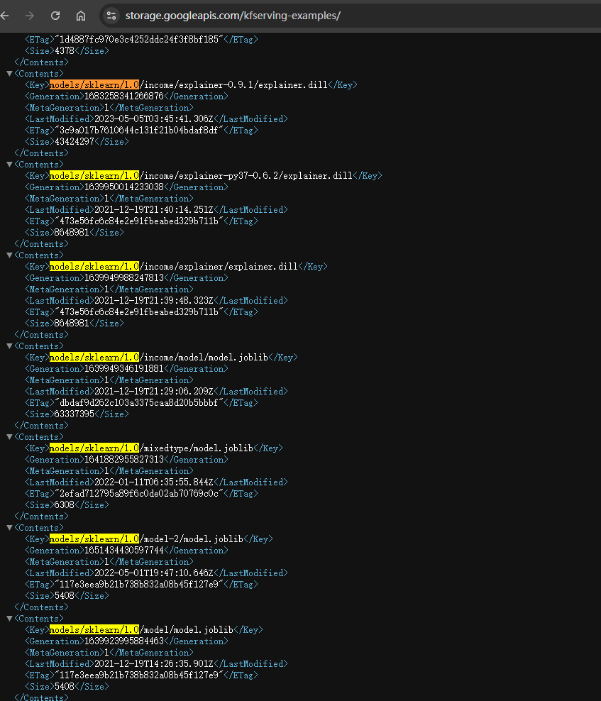
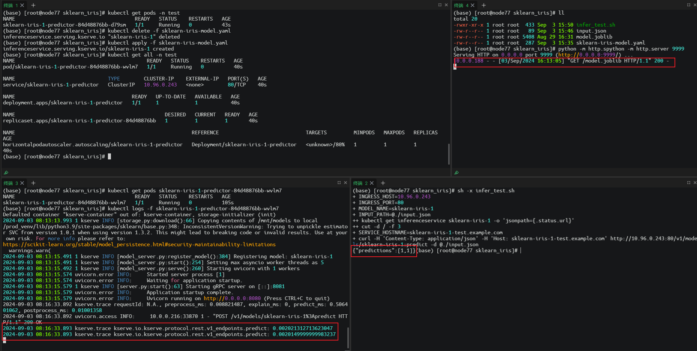

## 前置说明
Kserve 有多种安装部署模式，包括 Serverless、ModelMesh 以及 Kubernetes Deployment，下文的安装模型采用的  Kubernetes Deployment 中的 RawDeployment 模式，其他安装详见官方文档，

官方文档提到安装 Kserve 需要依赖 Istio 和 Cert Manager、由于 Isito 组件比较重且不太了解，考虑到我的目标是为了快速完成 kserve 的部署，所以就使用 Ingress-nginx 来替代了 Istio，效果是一样。另外安装时需要注意版本对应关系

| K8s | v1.29.7 |
| --- | --- |
| [KServe](https://github.com/kserve/kserve/releases/download/v0.10.0/) | v0.13.0 |
| [Cert-manager](https://cert-manager.io/docs/) | v1.15.3 |
| [Ingress-nginx](https://kubernetes.github.io/ingress-nginx/deploy/#quick-start)（[与k8s版本对应关系](https://github.com/kubernetes/ingress-nginx#supported-versions-table)） | v4.11.2 |


## 依赖组件
### ingress-nginx 部署
> 该组件采用[ Helm](https://helm.sh/) 安装
>

+ [官方文档](https://kubernetes.github.io/ingress-nginx/deploy/)
+ [安装包链接](https://github.com/kubernetes/ingress-nginx/releases)


- 如果在外网状态良好时，可以采用在线安装，由于当前是公司内网，所以采用将 helm 安装包下载下来，进行离线安装

```bash
# 添加repo
helm repo add ingress-nginx https://kubernetes.github.io/ingress-nginx

# 下载ingress-nginx.tgz
wget https://github.com/kubernetes/ingress-nginx/releases/download/helm-chart-4.11.2/ingress-nginx-4.11.2.tgz

# 解压
tar -zxf ingress-nginx-4.11.2.tgz

# 安装
helm install ingress-nginx ./ingress-nginx --namespace ingress-nginx --create-namespace


# 由于ingress-nginx依赖的镜像被墙无法下载，所以需要曲线救国，主要删除value.yaml中的镜像hash,需要在执行节点下载
docker pull k8s.kubesre.xyz/ingress-nginx/kube-webhook-certgen:v1.4.3
docker tag k8s.kubesre.xyz/ingress-nginx/kube-webhook-certgen:v1.4.3 registry.k8s.io/ingress-nginx/kube-webhook-certgen:v1.4.3

docker pull k8s.kubesre.xyz/ingress-nginx/controller:v1.11.2
docker tag k8s.kubesre.xyz/ingress-nginx/controller:v1.11.2 registry.k8s.io/ingress-nginx/controller:v1.11.2
```

+ 安装成功后满刻看到如下信息

```bash
(base) [root@node77 ingress-nginx]# helm install ingress-nginx ./ingress-nginx --namespace ingress-nginx
NAME: ingress-nginx
LAST DEPLOYED: Fri Aug 30 19:34:39 2024
NAMESPACE: ingress-nginx
STATUS: deployed
REVISION: 1
TEST SUITE: None
NOTES:
The ingress-nginx controller has been installed.
It may take a few minutes for the load balancer IP to be available.
You can watch the status by running 'kubectl get service --namespace ingress-nginx ingress-nginx-controller --output wide --watch'

An example Ingress that makes use of the controller:
  apiVersion: networking.k8s.io/v1
  kind: Ingress
  metadata:
    name: example
    namespace: foo
  spec:
    ingressClassName: nginx
    rules:
      - host: www.example.com
        http:
          paths:
            - pathType: Prefix
              backend:
                service:
                  name: exampleService
                  port:
                    number: 80
              path: /
    # This section is only required if TLS is to be enabled for the Ingress
    tls:
      - hosts:
        - www.example.com
        secretName: example-tls

If TLS is enabled for the Ingress, a Secret containing the certificate and key must also be provided:

  apiVersion: v1
  kind: Secret
  metadata:
    name: example-tls
    namespace: foo
  data:
    tls.crt: <base64 encoded cert>
    tls.key: <base64 encoded key>
  type: kubernetes.io/tls
(base) [root@node77 ingress-nginx]# kubectl get service --namespace ingress-nginx ingress-nginx-controller --output wide --watch
NAME                       TYPE           CLUSTER-IP    EXTERNAL-IP   PORT(S)                      AGE   SELECTOR
ingress-nginx-controller   LoadBalancer   10.96.1.190   <pending>     80:32702/TCP,443:32064/TCP   37s   app.kubernetes.io/component=controller,app.kubernetes.io/instance=ingress-nginx,app.kubernetes.io/name=ingress-nginx
```

### CertManager 部署
本组件采用 YAML 方式安装，若使用 Helm 安装，请参考：[Link](https://cert-manager.io/docs/installation/helm/)

+ [文档地址](https://cert-manager.io/docs/installation/kubectl/)
+ [下载地址](https://artifacthub.io/packages/helm/cert-manager/cert-manager)

```bash
kubectl apply -f https://github.com/cert-manager/cert-manager/releases/download/v1.15.3/cert-manager.yaml

(base) [root@node77 cert-manager]# kubectl get pods --namespace cert-manager
NAME                                       READY   STATUS    RESTARTS   AGE
cert-manager-cainjector-5fd6444f95-rbczx   1/1     Running   0          80s
cert-manager-d894bbbd4-zd8ns               1/1     Running   0          80s
cert-manager-webhook-869674f96f-cgp92      1/1     Running   0          80s
```


## kserve 部署
### 安装
+ [文档地址](https://kserve.github.io/website/latest/)： 当前最新版本 v0.13.0
+ [安装指南](https://kserve.github.io/website/latest/admin/kubernetes_deployment/)

```bash
kubectl apply -f https://github.com/kserve/kserve/releases/download/v0.13.0/kserve.yaml

kubectl apply -f https://github.com/kserve/kserve/releases/download/v0.13.0/kserve-cluster-resources.yaml

# 修改 inferenceservice-config 的部署模型为 RawDeployment
kubectl patch configmap/inferenceservice-config -n kserve --type=strategic -p '{"data": {"deploy": "{\"defaultDeploymentMode\": \"RawDeployment\"}"}}'


# 将kserve.yaml中ingressClassName的值修改为nginx，默认值为istio
ingress: |-
{
    "ingressClassName" : "nginx",
}

```

### 测试
1. 新建一个 Namespace

> 不要放在默认 namespace 下，很重要很关键，
>

```bash
kubectl create namespace test
```

2. 创建一个 inferenceservice

> 官方的案例的 yaml 中，并没有指定 namespace，如果执行下列命令就会创建到默认 namespace 下，后续部署模型就会遇到问题，该问题排查了好久。
>

+ 官网示例

```bash
kubectl apply -n test -f - <<EOF
apiVersion: "serving.kserve.io/v1beta1"
kind: "InferenceService"
metadata:
  name: "sklearn-iris"
spec:
  predictor:
    model:
      modelFormat:
        name: sklearn
      storageUri: "gs://kfserving-examples/models/sklearn/1.0/model"
EOF

```

+ 对上述内容进行修改。
    - 新建 yaml 文件(sklearn-iris-model.yaml)

```yaml
apiVersion: "serving.kserve.io/v1beta1"
kind: "InferenceService"
metadata:
  name: "sklearn-iris-1"
  namespace: "test"  # 这个很关键很重要
spec:
  predictor:
    model:
      modelFormat:
        name: sklearn
      storageUri: "http://172.16.x.xx:9999/model.joblib"
```

  - 由于官方给的示例的模型存储在 gs 上，一般情况下无法直接下载，我个人的解决方法是复制storageUri 的地址（models/sklearn/1.0/model），点开[平台下载链接](https://storage.googleapis.com/kfserving-examples/)的后，将路径拼在后面进行下载到本地（需要注意，需要下载该模型前缀下的所有资源，并放到一个文件夹下），然后在上传到部署的环境中。
  


3. 在模型文件夹下，启动一个 httpserver

> 该步骤非必须，如果可以直接从 gs 下，则忽略这一步。启动外部服务的目的是能够让 kserve 能够去下载模型
>

```bash
(base) [root@node77 test-kserve-deploy]# python -m http.server 9999
Serving HTTP on 0.0.0.0 port 9999 (http://0.0.0.0:9999/) ...
127.0.0.1 - - [03/Sep/2024 12:19:13] "GET / HTTP/1.1" 200 -

(base) [root@node77 kserve]# curl 127.0.0.1:9999
<!DOCTYPE HTML>
<html lang="en">
<head>
<meta charset="utf-8">
<title>Directory listing for /</title>
</head>
<body>
<h1>Directory listing for /</h1>
<hr>
<ul>
<li><a href="mlflow-iris.yml">mlflow-iris.yml</a></li>
<li><a href="mlflow-wine-model.yaml">mlflow-wine-model.yaml</a></li>
<li><a href="mlflow_wine/">mlflow_wine/</a></li>
<li><a href="mlflow_wine.zip">mlflow_wine.zip</a></li>
<li><a href="my_model/">my_model/</a></li>
<li><a href="my_model.zip">my_model.zip</a></li>
<li><a href="python_env.yaml">python_env.yaml</a></li>
<li><a href="python_model.pkl">python_model.pkl</a></li>
<li><a href="sklearn_iris/">sklearn_iris/</a></li>
<li><a href="tmp/">tmp/</a></li>
</ul>
<hr>
</body>
</html>
(base) [root@node77 kserve]#
```


+ 执行 yaml 文件

```bash
# 在此目录下
(base) [root@node77 sklearn_iris]# ls
model.joblib  sklearn-iris-model.yaml

# 执行命令
kubectl apply -f sklearn-iris-model.yaml
```

+ 查看模型部署状态

```bash
(base) [root@node77 sklearn_iris]# kubectl get all -n test
NAME                                            READY   STATUS    RESTARTS   AGE
pod/sklearn-iris-1-predictor-84d48876bb-wvlm7   1/1     Running   0          40s

NAME                               TYPE        CLUSTER-IP    EXTERNAL-IP   PORT(S)   AGE
service/sklearn-iris-1-predictor   ClusterIP   10.96.0.243   <none>        80/TCP    40s

NAME                                       READY   UP-TO-DATE   AVAILABLE   AGE
deployment.apps/sklearn-iris-1-predictor   1/1     1            1           40s

NAME                                                  DESIRED   CURRENT   READY   AGE
replicaset.apps/sklearn-iris-1-predictor-84d48876bb   1         1         1       40s

NAME                                                           REFERENCE                             TARGETS         MINPODS   MAXPODS   REPLICAS   AGE
horizontalpodautoscaler.autoscaling/sklearn-iris-1-predictor   Deployment/sklearn-iris-1-predictor   <unknown>/80%   1         1         1          40s
```

+ 查看 inferenceservice 状态

```bash
(base) [root@node77 sklearn_iris]# kubectl get inferenceservice -n test
NAME             URL                                      READY   PREV   LATEST   PREVROLLEDOUTREVISION   LATESTREADYREVISION   AGE
sklearn-iris-1   http://sklearn-iris-1-test.example.com   True                                                                  5m48s
```


使用 ingress 测试

+ 查看 ingress-nginx 访问地址

```bash
(base) [root@node77 sklearn_iris]# kubectl get svc -n test
NAME                       TYPE        CLUSTER-IP    EXTERNAL-IP   PORT(S)   AGE
sklearn-iris-1-predictor   ClusterIP   10.96.0.243   <none>        80/TCP    7m2s
```

+ 编写输入参数 文件，input.json

```json
{
  "instances": [
    [6.8,  2.8,  4.8,  1.4],
    [6.0,  3.4,  4.5,  1.6]
  ]
}
```

+ 编写测试脚本

```bash
#!/bin/bash

# nginx ingress 的访问地址
INGRESS_HOST=10.96.0.243
INGRESS_PORT=80

MODEL_NAME=sklearn-iris-1
INPUT_PATH=@./input.json

SERVICE_HOSTNAME=$(kubectl get inferenceservice ${MODEL_NAME} -o jsonpath='{.status.url}' | cut -d "/" -f 3)

# 使用 curl 发起请求
curl -H "Content-Type: application/json" -H "Host: ${SERVICE_HOSTNAME}" http://${INGRESS_HOST}:${INGRESS_PORT}/v1/models/$MODEL_NAME:predict -d $INPUT_PATH

```

+ 执行测试 `sh -x infer_test.sh`
+ 测试结果如下图


